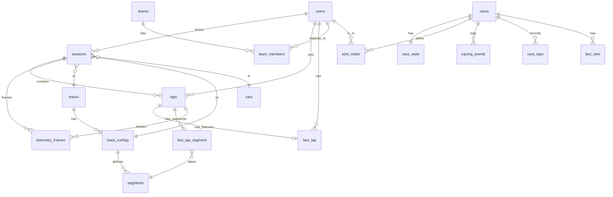

# Database Architecture

## Overview

The database is structured in three layers:

```
┌─────────────────────────────────────────────────────────────┐
│  LAYER 1: OLTP / Operational                                │
│  users, sessions, laps, races, race_state, race_events,     │
│  stint_roster, stint_planner_sessions, teams, team_members  │
│  iracing_events, race_laps                                  │
└─────────────────────────────────────────────────────────────┘
             ↓ raw writes                ↓ event writes
┌──────────────────────┐    ┌────────────────────────────────┐
│  LAYER 2: Raw Ingest │    │  LAYER 2b: Operational Events  │
│  live_telemetry      │    │  iracing_events                │
│  (14-day retention)  │    │  (kept long-term)              │
└──────────────────────┘    └────────────────────────────────┘
             ↓ normalised frames
┌─────────────────────────────────────────────────────────────┐
│  LAYER 3: Analytics / Warehouse                             │
│  telemetry_frames  ← canonical replay/analysis source       │
│  fact_lap          ← lap-level metrics                      │
│  fact_lap_segment  ← segment/corner metrics                 │
│  fact_stint        ← per-stint race summary                 │
│                                                             │
│  Serving Marts (views):                                     │
│  mart_live_race_state, mart_driver_consistency,             │
│  mart_corner_time_loss, mart_lap_comparison()               │
│                                                             │
│  Dimensions (views):                                        │
│  dim_user, dim_track, dim_track_config, dim_car,           │
│  dim_session, dim_lap, dim_segment                          │
└─────────────────────────────────────────────────────────────┘
```

## Table Grain Reference

| Table | Grain | Write path | Read path |
|---|---|---|---|
| `users` | one per user | signup, team routes | auth, all features |
| `sessions` | one per practice/live session | telemetry upload, live ingest | session list, replay |
| `laps` | one per lap | telemetry parser | coaching, library, comparison |
| `races` | one per race event | race management UI | live tracker |
| `race_state` | one per race (PK=race_id) | desktop client events | live tracker via mart |
| `race_events` | one per calendar entry | race calendar UI | calendar page |
| `race_laps` | one per lap completed in a race | position_update handler | race page lap history |
| `stint_roster` | one per planned stint | race management UI | live tracker |
| `stint_planner_sessions` | one per shared race plan | stint planner UI | planner page |
| `teams` | one per team | team management UI | team page |
| `team_members` | one per (team, member) | team management UI | team page |
| `iracing_events` | one per desktop client event | desktop client POST | event log, notifications |
| `live_telemetry` | one per ingest batch | desktop client telemetry POST | live telemetry endpoint |
| `telemetry_frames` | one per sample point | live ingest, IBT parser | replay, coaching, AI |
| `fact_lap` | one per lap | computed post-lap | coaching dashboard |
| `fact_lap_segment` | one per (lap, segment) | computed post-lap | corner analysis |
| `fact_stint` | one per driver stint | computed from events | stint analysis |
| `tracks` | one per track | backfill/manual | dimension joins |
| `track_configs` | one per track layout | backfill/manual | dimension joins |
| `cars` | one per car model | backfill/manual | dimension joins |
| `segments` | one per (track_config, segment) | backfill from corner_segments | segment analytics |

## Source of Truth for Telemetry

**`telemetry_frames` is the canonical source for ALL telemetry reads.**

- Session replay → query `telemetry_frames` by `(session_id, ts)` or `(session_id, lap_number, lap_dist_pct)`
- Lap overlay → query `telemetry_frames` by `lap_id`, order by `lap_dist_pct`
- Delta time → use `mart_lap_comparison(ref_lap_id, cmp_lap_id)`
- Segment metrics → query `fact_lap_segment` (computed from telemetry_frames)
- AI coaching → `fact_lap` + `fact_lap_segment` + `telemetry_frames`

**`live_telemetry` is NOT for analytics.** It is a short-lived raw buffer for the live race telemetry stream only. Retain 14 days, then purge with `cleanup_live_telemetry()`.

## Dimension Normalization

Sessions historically stored track/car as free-text strings (`track_id VARCHAR`, `car_id VARCHAR`). The refactored design adds normalized dimension tables:

- `tracks` — canonical track record; `track_code` matches legacy `sessions.track_id`
- `track_configs` — track layout variants; linked from `sessions.track_config_ref_id`
- `cars` — car models; `car_code` matches legacy `sessions.car_id`
- `segments` — track segments; normalized from `corner_segments`

Sessions have both legacy text columns AND new FK columns:
- `sessions.track_id` — legacy (kept for compat)
- `sessions.track_ref_id` — FK to `tracks` (populated by backfill/001)
- `sessions.track_config_ref_id` — FK to `track_configs`
- `sessions.car_ref_id` — FK to `cars`

## Key Example Queries

### Lap replay ordered by distance
```sql
SELECT session_time, lap_dist_pct, speed_kph, throttle, brake, steering_deg, gear
FROM telemetry_frames
WHERE lap_id = $1
ORDER BY lap_dist_pct;
```

### Compare two laps (distance-bucketed)
```sql
SELECT * FROM mart_lap_comparison($ref_lap_id, $cmp_lap_id);
-- or with custom bucket size:
SELECT * FROM mart_lap_comparison($ref_lap_id, $cmp_lap_id, 0.002);
```

### Session summary for coaching
```sql
SELECT l.lap_number, l.lap_time, fl.max_speed_kph, fl.avg_speed_kph,
       fl.brake_zone_count, fl.consistency_score
FROM laps l
LEFT JOIN fact_lap fl ON fl.lap_id = l.id
WHERE l.session_id = $1 AND l.is_valid = TRUE
ORDER BY l.lap_number;
```

### Corner time loss for a lap
```sql
SELECT segment_name, segment_type, time_loss, entry_speed_kph, apex_speed_kph
FROM mart_corner_time_loss
WHERE lap_id = $1
ORDER BY segment_number;
```

### Live race state
```sql
SELECT * FROM mart_live_race_state WHERE is_active = TRUE;
```

### Driver consistency for a session
```sql
SELECT username, lap_count, best_lap_time, avg_lap_time, lap_time_stddev, consistency_score
FROM mart_driver_consistency
WHERE session_id = $1;
```

## Retention Policy

| Table | Retention | Notes |
|---|---|---|
| `live_telemetry` | 14 days | Call `SELECT * FROM cleanup_live_telemetry(14)` |
| `telemetry_frames` | Indefinite | Long-term canonical store |
| `fact_lap` | Indefinite | Aggregated, small |
| `fact_lap_segment` | Indefinite | Aggregated, small |
| `iracing_events` | Indefinite | Operational log |
| All other operational tables | Indefinite | User/race data |

## ERD (Mermaid)


